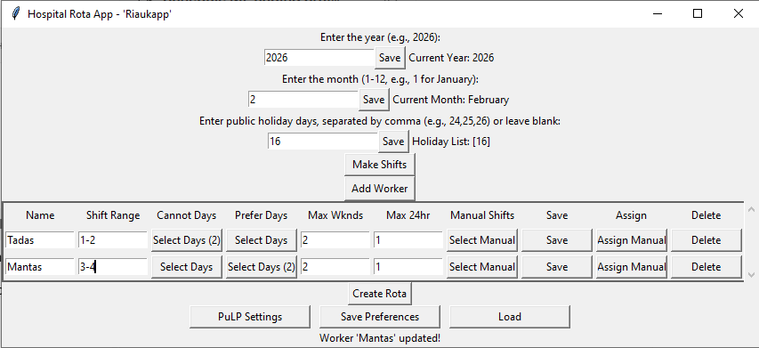
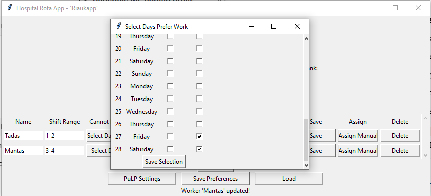
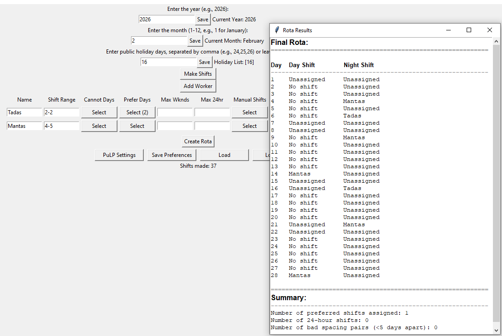

# Hospital Rota App

Python desktop app for scheduling 12-hour hospital shifts (day/night) with hard constraints, soft preferences, and a point system to find the best possible rota.

## Features
- Select any month/year
- Mark public holidays
- Add workers with:
  - Shift range (e.g. 2-4)
  - Cannot-work shifts
  - Preferred shifts
  - Max weekends
  - Max 24-hour (day+night same day) shifts
- Manual shift assignment
- Hard rules (no night → day, no adjacent nights/days)
- Soft rules + point system (PuLP)
- Save/Load entire rota configuration

## How to run
```bash
pip install -r requirements.txt
python hospital_rota_app.py

## Screenshots




